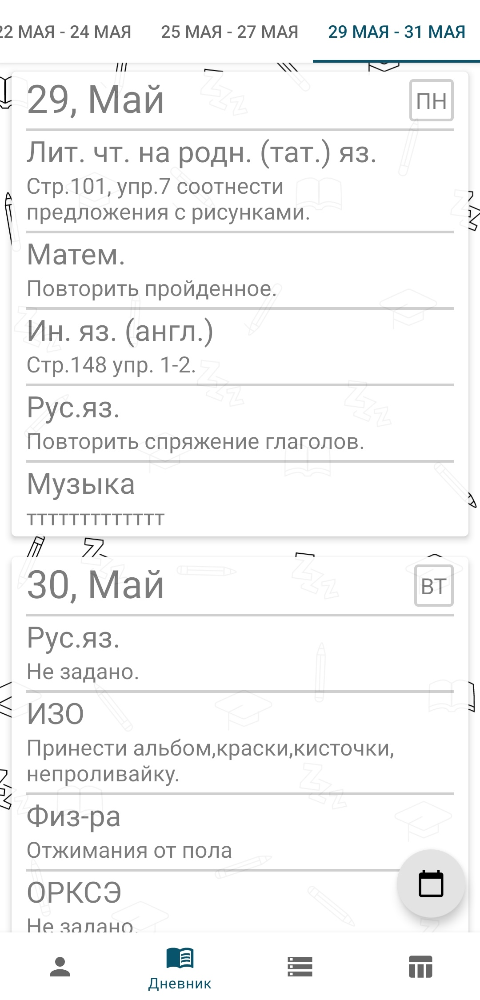
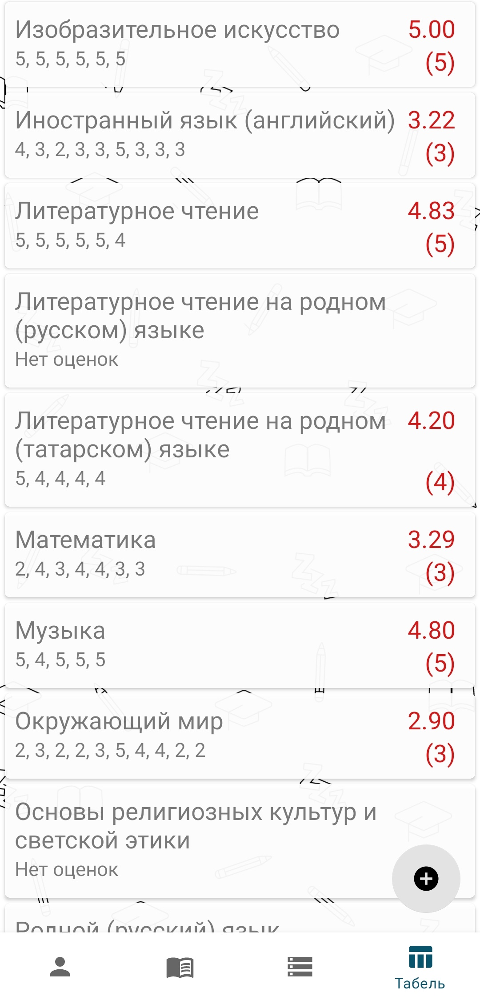
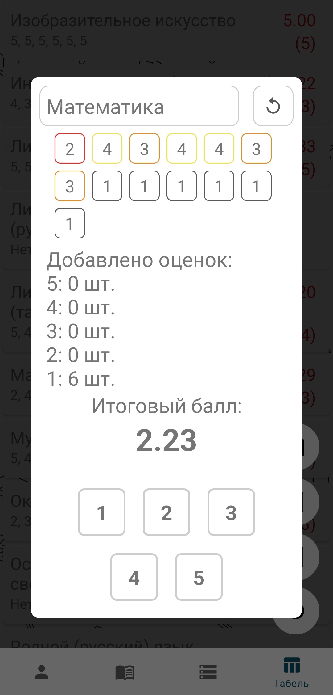

# EduClient

EduClient is an app that allows users to:

- View schedules
- Check homework
- Monitor grades
- Calculate required scores for a specific grade

### Key Features:
- Grade calculator
- Notifications for new grades
- Homework progress tracking
- Easy account switching
- Offline data viewing through caching
- Access to the Electronic Education in Tatarstan ([edu.tatar.ru](https://edu.tatar.ru))

